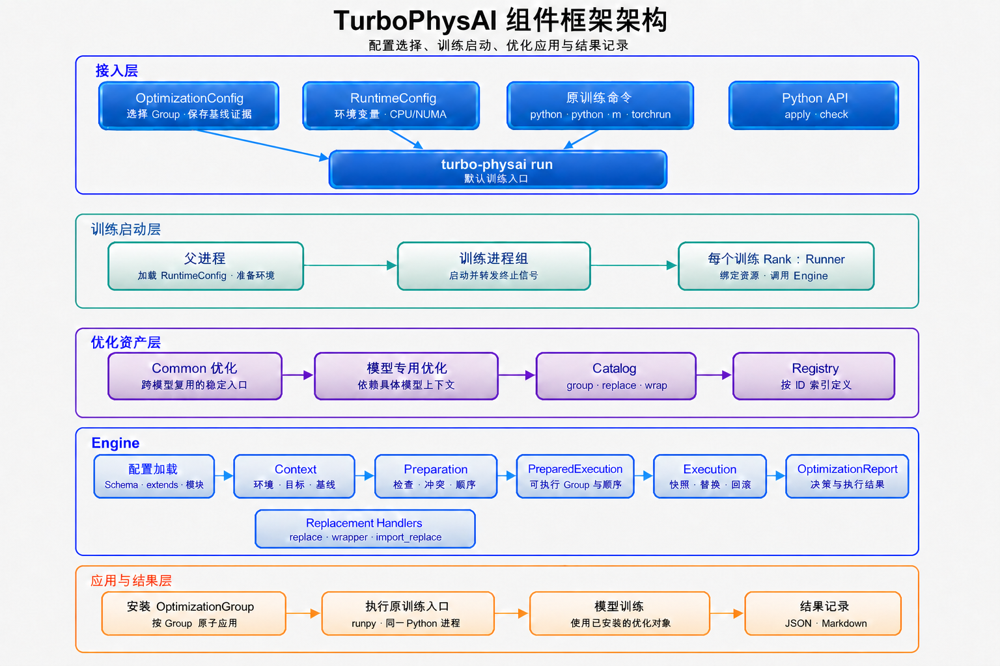

# 组件架构

本文面向框架维护人员和需要深入理解执行过程的优化开发者。训练用户无需先阅读本章。



## 设计目标

TurboPhysAI 将 Replacement 与安全应用流程分开：

- 优化代码负责实际计算；
- Catalog 负责声明可以替换的入口和功能边界；
- OptimizationConfig 负责选择本次交付的优化；
- 框架负责环境检查、冲突判断、执行顺序、回滚和 OptimizationReport；
- 模型工程无需修改上游业务实现。

## 分层结构

### 接入层

公开入口为：

- `turbo_physai.apply()`：检查并应用一次 OptimizationConfig；
- `turbo_physai.check()`：生成应用决策但不安装 Replacement；
- `group/replace/wrap`：优化开发声明；
- `turbo-physai`：OptimizationConfig、RuntimeConfig、训练启动和外部开发工程 CLI。

顶层包延迟加载算子模块，使 OptimizationConfig Schema 和 Catalog 可以在不初始化 Torch/HCU 算子的情况下导入。

### 优化资产层

- `operators/`：可直接调用的算子级 Python API；
- `optimizations/common/<framework>/`：按上层框架或基础库划分的跨模型公共优化；当前 `optimizations/common/mmcv/` 是其中一个子目录；
- `optimizations/models/<model>/`：依赖模型上下文的优化；
- `optimizations/common/configs/`：默认公共优化配置；
- `optimizations/models/<model>/configs/`：随模型实现集中存放配方、OptimizationConfig 与 RuntimeConfig。

Catalog 使用字符串声明 target 和 Replacement，不在声明阶段导入真实模型或重型算子实现。
公共框架 Catalog 随 TurboPhysAI 初始化登记；模型 Catalog 不做全局汇总，由对应
OptimizationConfig 的 `optimization_modules` 按需导入。

### 应用前检查

- Loader 读取 YAML、展开内置 `extends` 并导入外部 `optimization_modules`；
- Registry 通过稳定 ID 索引内部 ReplacementSpec 和 OptimizationGroup；
- Context 采集 Python、平台、依赖、Git、backend 和 rank 信息；
- Handler 解析真实 target、aliases 和 Replacement；
- Checker 执行统一基础检查，并运行 Group 显式声明的兼容条件；
- Conflict Analyzer 检查入口重复、冲突和依赖；
- 检查结果与 Group 依赖共同确定 `apply/skip/block` 状态和执行顺序。

### 执行层

Executor 只执行 `PreparedExecution.execution_order` 中的 Group。每个 Group 在首次修改前准备全部成员并保存 target 快照，成员失败后按逆序回滚。Reporter 将 Preparation 和 Execution 结果写入 OptimizationReport。

### 启动层

`turbo-physai run` 加载 RuntimeConfig、准备环境变量与启动钩子，然后用 `exec` 替换
自身执行训练命令。命令不被解析也不被改写，因此不限制启动器形式，且进程树中不留
中间进程。

每个训练 rank 的解释器在启动时由标准库 `site` 自动导入 `turbo_physai/bootstrap`
下的钩子，先准备运行环境并执行 `apply()`，再进入原训练入口。启动器进程
（`torchrun` 等）本身不安装 Python Replacement。

### HCU 实现层

优化最终可以调用：

- 编译进 `turbo_physai.ops` 的 HCU/CUDA Kernel；
- hipDNN；
- LightOp；
- PyTorch、Autograd 和 `torch.library`；
- 外部优化包提供的算子。

## 工程目录

```text
turbo_physai/
├── kernel/                         # 原生算子源码
├── turbo_physai/
│   ├── csrc/                       # 统一 PyBind 入口
│   ├── operators/                  # 可直接调用的算子 Python API
│   ├── optimizations/
│   │   ├── common/                 # 跨模型公共优化
│   │   │   ├── catalog.py          # 公共优化登记入口
│   │   │   ├── configs/            # 默认公共 OptimizationConfig
│   │   │   ├── mmcv/
│   │   │   │   ├── catalog.py
│   │   │   │   └── configs/
│   │   │   └── mmdet3d/
│   │   │       ├── catalog.py
│   │   │       └── configs/
│   │   └── models/                 # 模型专用优化
│   │       ├── bevformer/
│   │       │   ├── catalog.py
│   │       │   └── configs/
│   │       └── bevfusion/
│   │           ├── catalog.py
│   │           └── configs/
│   ├── engine/
│   │   ├── definitions/            # Group 和 Replacement 声明、登记
│   │   ├── config/                 # OptimizationConfig 加载、校验和生成
│   │   ├── checking/               # 环境、证据、依赖与冲突检查
│   │   ├── execution/              # Replacement、快照、回滚和报告
│   │   ├── contracts.py            # 各阶段共享的数据结构
│   │   └── errors.py               # Engine 异常
│   ├── development/                # 外部优化工程初始化
│   ├── compatibility.py            # 兼容性补丁声明接口
│   ├── bootstrap/                  # 解释器启动钩子，在 rank 内自动激活
│   ├── runner.py                   # rank 内应用 OptimizationConfig 并执行训练入口
│   ├── runtime.py                  # RuntimeConfig 加载与进程环境准备
│   └── cli.py                      # 命令行入口
├── model_examples/
│   ├── BEVFormer/                  # BEVFormer 应用说明
│   └── BEVFusion/                  # BEVFusion 应用说明
├── docs/                            # 对外文档
├── scripts/                         # 文档检查和工程辅助脚本
├── test/                            # 算子、Engine 和 Runner 测试
├── third_party/                     # 第三方许可证材料
└── setup.py                         # Python 包和原生扩展构建
```

## 三个生命周期

### 开发期

开发者在外部工程实现 Replacement、声明 Group、按需增加兼容条件、维护最小配方并生成最终 YAML。冲突必须在这一阶段解决。

### 启动期

父进程依据 RuntimeConfig 准备启动环境。每个训练 rank 在导入模型训练入口前调用 `apply()`，解析当前 Python 对象、检查环境和基线、确定执行顺序并完成替换。

### 运行期

模型调用已经安装的优化对象。默认情况下，输入语义错误、设备异常或编译问题由 Replacement 直接暴露，不自动 fallback。声明 `runtime_condition` 时，框架安装调用期条件分发对象，并在条件为 `False` 时调用原实现；条件函数与 Replacement 的异常仍直接向上传播。OptimizationReport 记录的是启动期安装结果，不是完整训练正确性的证明。
