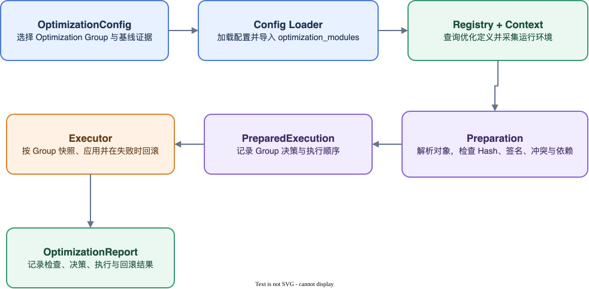

# 优化应用与回滚

## 完整链路

## 1. 对象解析

`replace` 和 `wrap` 都先解析主 target 与 aliases，并确认它们指向同一原对象，然后解析 Replacement。

直接替换根据真实 target 判断 callable、class 或 property，并要求 Replacement 具有对应类型。Wrapper 构造函数接收原对象和 Group options，返回最终 callable。

## 2. 检查

检查分为 OptimizationConfig 级和 Group 级。OptimizationConfig 级检查对当前运行环境执行一次，包括：

- OptimizationConfig 声明的依赖版本、dirty、backend 和 repository；
- 仅用于报告的参考 commit。

每个选中 Group 独立检查：

- target 能否解析；
- aliases 是否仍指向同一原对象；
- Replacement 能否加载；
- target 和 Replacement 类型；
- 调用签名；
- target source/AST Hash；
- Group 内和 Group 间冲突；
- 依赖缺失或成环。

所有 Group 使用同一套基础检查。基础检查负责确认对象可解析、类型与签名兼容、Alias 身份一致，以及目标代码与 OptimizationConfig 中的 Hash 证据一致。

Group 对特定依赖版本、模型基线或实现约束有额外要求时，可以声明一个 `compatibility_check`。框架在该 Group 的所有成员完成解析后执行一次兼容条件；不满足条件时，该 Group 在应用前被 `block`。未声明兼容条件的 Group 只执行基础检查。

模型导入前兼容处理使用独立的导入兼容 Group。Engine 先应用导入别名、精确的可选模块占位和受限 Registry 覆盖，再解析普通 Replacement 的 target。导入兼容成员与普通优化成员不能声明在同一个 Group 中。某个导入兼容 Group 应用失败时，该 Group 回滚自身；任一导入兼容 Group 被阻断或未成功应用时，普通优化不再准备和执行。已经成功应用的其他导入兼容 Group 不随之回滚。

OptimizationConfig 顶层 commit 检查匹配时为 `pass`，不匹配或无法获取时为 `warning`，始终不直接决定 Group 是否执行。该结果作为 OptimizationConfig 级检查只在 OptimizationReport 中记录一次。

所有 `replace` 和 `wrap` target 都执行 source 身份检查。source Hash 对源码文本敏感；AST Hash 忽略部分格式差异。两者任意一个与 OptimizationConfig 证据匹配即可通过。

`runtime_condition` 不属于启动期兼容检查。它在优化安装后对每次业务调用选择 Replacement 或原实现，用于表达输入级能力边界。

## 3. 冲突和顺序

应用前检查不允许两个成员依赖注册顺序覆盖同一入口：

- Group 内同 target/alias：Group 内重复或冲突；
- Group 间同 target/alias：Group 重复或冲突；
- import replacement 父子路径重叠：路径冲突；
- `depends_on` 缺失或成环：依赖错误。

没有依赖的 Group 保持最终 OptimizationConfig 声明顺序；有 `depends_on` 时执行稳定拓扑排序。

## 4. 决策

- `apply`：检查通过，进入 execution order；
- `skip`：Group 不参与本次执行，包括配置未启用、命令行临时禁用或依赖项被禁用；
- `block`：检查或依赖未通过。

决策为 `block` 的 Group 不执行，依赖它的下游 Group 同样不执行，其他独立 Group 继续。

## 5. 事务执行

对于一个 Group：

1. 确认所有成员都已准备完成；
2. 在第一次赋值前保留所有主 target 和 aliases 的原对象；
3. 按成员顺序安装 Replacement；
4. 任一成员失败时，按逆序使用完整快照恢复 Group；
5. 读取恢复后的对象，并确认其身份与快照一致。

“原子性”是功能层面的：Group 表达一项不可拆分优化，而不仅是代码之间互不干扰。

## 6. 失败行为

- 应用失败且回滚成功：Group 记为 `rolled_back`，依赖它的 Group 不启动，其他独立 Group 继续；
- 快照阶段失败：Group 记为 `failed`，尚未处理的成员记为 `not_started`；
- Group 中尚未执行的成员，或因依赖未成功而未执行的 Group，记为 `not_started`；
- 回滚失败：进程状态不可信，停止后续执行并抛出 `OptimizationRollbackError`；
- Replacement 在后续训练调用时失败：不触发启动期事务回滚，也不自动 fallback，应根据 Traceback 修复或禁用 Group。声明 `runtime_condition` 的调用仅在条件明确返回 `False` 时使用原实现；条件函数或 Replacement 异常仍向上传播。

动态库加载、Torch Operator 注册、设备上下文和模块导入副作用不能通过 Python 对象重新赋值完整回滚。

## 7. check 的边界

`check()` 复用解析、检查和 Preparation 过程，不安装普通 Replacement。为解析后续 target，导入兼容 Group 会在检查期间临时应用，并在检查完成后恢复。Engine 同时尽力还原 `sys.modules` 映射。

检查过程仍可能：

- 导入 target 和 Replacement 模块；
- 构造 Wrapper；
- 触发动态库或 Torch Operator 注册；
- 产生编译对象和其他导入期副作用。

因此，`check()` 不改变普通 target 和 Alias 的最终指向，但不是无进程副作用的隔离环境。导入模块、Wrapper 构造和原生扩展注册产生的副作用不一定能够完整撤销。
