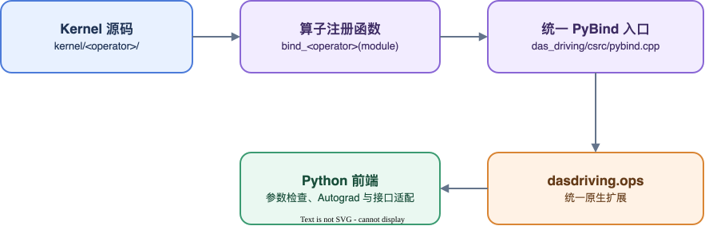

# 自定义算子接入

本文说明如何将自定义算子源码接入 TurboPhysAI 的统一扩展，并将算子能力提供给 Python API 或优化 Group。适用对象为算子开发人员和模型优化开发人员。

开始接入前，应先完成算子的数值、梯度和性能验证。优化 Group 的声明方式参见 [定义优化与组织优化组](optimization_declarations.md)。

## 统一扩展

TurboPhysAI 将仓库内的原生算子统一编译为 `turbo_physai.ops`。构建过程由 `setup.py` 完成：

- 递归收集 `kernel/` 和 `turbo_physai/csrc/` 下的 `.cu`、`.cpp`、`.cc`、`.cxx`；
- 自动收集 `kernel/` 下包含头文件的目录；
- 通过唯一的 `PYBIND11_MODULE` 生成一个 Python 扩展。

完整调用链如下：



Python 前端可以直接提供算子 API，也可以作为 Replacement 由 Optimization Group 应用到模型入口。

新增算子不得定义独立的 `PYBIND11_MODULE`，否则会与统一扩展入口冲突。

## 1. 添加 Kernel 源码

每个算子在 `kernel/` 下使用独立目录，源码和头文件按实现需要组织。例如仓库中的 BEV Pool：

```text
kernel/bev_pool/
└── src/
    ├── bev_pool_cpu.cpp
    └── bev_pool_cuda.cu
```

源码接入需要满足以下要求：

- 仓库只维护原始 `.cu`、`.cpp`、`.cc`、`.cxx` 和头文件；
- 不提交构建生成的 `.hip`、`*_hip.h`、`*_hip.cpp`、`*_hip.cuh` 或 `*_hip.hpp`；
- 保留上游版权声明和许可证信息，并标明本项目修改；
- 避免与其他算子产生全局符号重名；
- 保持 Python 前端所依赖的参数、返回值和梯度契约。

`setup.py` 会自动发现符合上述规则的源码，新增算子目录不需要修改源码收集列表。

## 2. 注册 PyBind 接口

算子源文件提供一个注册函数，由统一入口调用。BEV Pool 使用以下形式：

```cpp
void bind_bev_pool(py::module_ &m) {
  m.def("bev_pool_forward", &bev_pool_forward, "bev_pool_forward");
  m.def("bev_pool_backward", &bev_pool_backward, "bev_pool_backward");
  m.def("bev_pool_prepare", &bev_pool_prepare_forward,
        "bev_pool_prepare");
  m.def("bev_pool_prepare_geometry", &bev_pool_prepare_geometry_forward,
        "bev_pool_prepare_geometry");
}
```

在 `turbo_physai/csrc/pybind.cpp` 中声明并调用该函数：

```cpp
void bind_bev_pool(py::module_ &m);

PYBIND11_MODULE(TORCH_EXTENSION_NAME, m) {
  // 其他算子注册省略。
  bind_bev_pool(m);
}
```

构建后，接口通过统一模块访问：

```python
from turbo_physai import ops

output = ops.bev_pool_forward(
    features,
    coordinates,
    interval_lengths,
    interval_starts,
    batch_size,
    depth,
    height,
    width,
)
```

导出名称属于 Python 接口契约。修改名称、参数顺序或返回值时，需要同步更新 Python 前端和对应测试。

## 3. 编写 Python 前端

Python 前端负责将原生接口组织成稳定、可测试的 Python 能力，包括必要的参数转换、连续内存处理和 Autograd 定义。文件位置由能力范围决定：

| 能力范围                       | 代码位置                                          | 仓库案例                    |
| ------------------------------ | ------------------------------------------------- | --------------------------- |
| 可由用户直接调用的通用算子 API | `turbo_physai/operators/`                        | `grid_sample.py`          |
| 仅用于某个公共框架入口的优化   | `turbo_physai/optimizations/common/<framework>/` | `mmdet3d/bev_pool.py`     |
| 依赖具体模型计算链路的实现     | `turbo_physai/optimizations/models/<model>/`     | 模型专用 Forward 或 Wrapper |

### 3.1 通用算子 API：GridSample

`turbo_physai/operators/grid_sample.py` 从统一扩展导入 Forward 和 Backward，并使用 `torch.autograd.Function` 维护梯度契约：

```python
import torch

from turbo_physai.ops import grid_sample_backward, grid_sample_forward


class GridSampleFunction(torch.autograd.Function):
    @staticmethod
    def forward(ctx, input, grid, mode, padding_mode, align_corners):
        ctx.mode = mode
        ctx.padding_mode = padding_mode
        ctx.align_corners = align_corners
        ctx.save_for_backward(input, grid)
        return grid_sample_forward(
            input, grid, mode, padding_mode, align_corners
        )

    @staticmethod
    def backward(ctx, grad_output):
        input, grid = ctx.saved_tensors
        grad_input, grad_grid = grid_sample_backward(
            grad_output,
            input,
            grid,
            ctx.mode,
            ctx.padding_mode,
            ctx.align_corners,
            [True, True],
        )
        return grad_input, grad_grid, None, None, None
```

该形式适用于具有独立 Python API、可以脱离具体模型调用的算子。

### 3.2 公共框架优化：BEV Pool

BEV Pool 的 Python 前端位于 `turbo_physai/optimizations/common/mmdet3d/bev_pool.py`。它延迟获取 `turbo_physai.ops`，并在 Python 层完成连续内存处理和参数类型转换：

```python
def _ops():
    from turbo_physai import ops

    return ops


def bev_pool_prepare(geom_feats, bx, dx, nx, B, D, H, W):
    extension = _ops()
    return extension.bev_pool_prepare(
        geom_feats.contiguous(),
        bx.contiguous(),
        dx.contiguous(),
        nx.contiguous(),
        int(B),
        int(D),
        int(H),
        int(W),
    )
```

同一文件中的 `NativeQuickCumsumCuda` 使用 `torch.autograd.Function` 连接 `bev_pool_forward` 和 `bev_pool_backward`。延迟导入用于避免仅加载优化声明时提前加载原生扩展；算子首次被实际调用时，Python 前端才访问 `turbo_physai.ops`。

## 4. 声明优化 Group

需要替换上游框架入口时，在对应公共优化 Catalog 中声明 Group。仓库中的 `mmdet3d.bev_pool` 将 MMDetection3D 的稳定入口替换为 TurboPhysAI 的 Python 前端：

```python
from turbo_physai import group, replace


BEV_POOL = group(
    "mmdet3d.bev_pool",
    replace(
        target="mmdet3d.ops.bev_pool.bev_pool.bev_pool",
        aliases=("mmdet3d.ops.bev_pool.bev_pool",),
        replacement=(
            "turbo_physai.optimizations.common.mmdet3d.bev_pool.bev_pool"
        ),
    ),
)
```

Group 只声明 Python 对象的替换关系。原生算子已经随 `turbo_physai.ops` 构建和安装，不由 Group 在运行时编译或加载。

公共算子优化应只依赖稳定的框架入口，不应包含模型专用的 Forward 改写、数据链路调整或 `torch.compile` 包装。模型专用优化可以通过依赖公共 Group 复用该算子能力。

## 5. 验证要求

### 5.1 必须验证

- 支持范围内的 Forward 数值；
- dtype、shape、layout、device 和边界输入；
- 不支持输入的明确异常；
- 原生接口能够从 `turbo_physai.ops` 导入和调用；
- 构建产物中不存在重复的 `PYBIND11_MODULE`；
- 构建过程未将生成的 HIP 文件纳入维护源码。

### 5.2 按使用场景验证

- 训练需要梯度时，验证模型实际使用的全部 Backward；
- 算子进入 `torch.compile` 链路时，验证 FakeTensor、图捕获和重编译行为；
- 算子注册 PyTorch Dispatcher 时，验证 schema、设备实现和注册冲突；
- 算子跨软件版本交付时，验证 PyTorch、编译器和设备运行时 ABI；
- 算子作为公共优化交付时，验证对应 Group 的配置生成、检查、应用和回滚。

数值测试应与参考实现使用相同输入，并明确容差。性能测试应记录设备、软件版本、shape、dtype、预热次数和统计方法。

## 6. 接入边界

自定义算子源码在构建 TurboPhysAI wheel 时统一编译为 `turbo_physai.ops`。训练启动阶段只加载已安装的扩展，不执行算子编译。

OptimizationConfig 用于选择和应用 Python 接口替换，不负责构建或安装原生算子。因此：

- 仓库内算子应通过统一构建链路交付；
- 算子依赖的运行库应由发布镜像或运行环境预先提供；
- Group 回滚只恢复 Python 对象引用，不改变已经加载的原生扩展。

算子构建、安装和导入验证必须在发布前完成，不能推迟到模型训练阶段。
