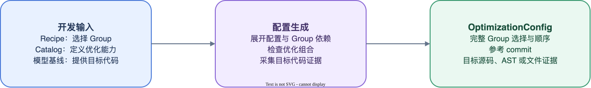

# 生成和检查 OptimizationConfig

TurboPhysAI 通过 `target` 路径定位需要替换的 Python 对象。路径只能说明对象位于何处，不能证明当前对象仍是优化开发和验证时使用的实现；不同模型版本可能保留相同路径，但已经修改函数内容或调用约定。仅根据路径安装 Replacement，可能将优化应用到不兼容的目标代码上。

Recipe 和 Catalog 是开发阶段的输入：Recipe 选择需要交付的 Group，Catalog 定义 Group 成员、依赖关系、目标和 Replacement。配置生成器将它们与已验证的模型基线结合：



生成后的 OptimizationConfig 保存展开的 Group 选择及目标源码、AST 或原生扩展文件证据。模型配置还会记录参考 commit。训练应用时，框架重新解析当前目标并比较这些证据，只对仍满足条件的 Group 安装 Replacement。目标代码证据决定优化是否适用，参考 commit 用于记录模型配置的生成基线。

## 1. 配置生成涉及的对象

| 对象 | 维护方式 | 内容 |
| --- | --- | --- |
| Optimization Catalog | Python 代码 | Group、`target`、`aliases`、Replacement 和 `depends_on` |
| `recipe.yaml` | 优化开发者维护 | 配置身份、Optimization Catalog 模块、继承配置、Group 选择和 `options` |
| `optimization.yaml` | `optimization generate` 生成 | 展开的 Group、目标的 source、AST 或原生扩展文件证据；模型配置同时记录参考 commit |

内置模型的 `optimization.yaml` 随 TurboPhysAI 交付。训练用户通过 `turbo-physai run --model <model>` 启动时，Runner 自动选择对应配置；自定义交付可以通过 `--optimization-config` 显式指定配置路径。

## 2. 生成前提

生成 OptimizationConfig 前需要满足以下条件：

- 模型仓库的 HEAD 与待验证 commit 一致；
- 模型工作区不存在未提交修改；
- `recipe.yaml` 中 `optimization_modules` 声明的 Python 模块可以导入；
- 配方引用的 Optimization Group 已完成登记。

可以使用以下命令确认模型仓库状态：

```bash
git -C /path/to/model rev-parse HEAD
git -C /path/to/model status --short
```

`optimization generate` 会再次执行上述仓库检查，不满足条件时不会生成配置。

公共 Recipe 不声明 `model.name`，生成的公共配置不绑定具体模型 commit。`--commit` 仍用于确认采集目标证据时所用仓库的 HEAD，不会写入公共配置。

## 3. 生成 OptimizationConfig

以下命令使用仓库内的 BEVFormer 配方生成 OptimizationConfig。命令从 TurboPhysAI 仓库根目录执行：

```bash
turbo-physai optimization generate \
  --recipe turbo_physai/optimizations/models/bevformer/configs/recipe.yaml \
  --repo /path/to/BEVFormer \
  --commit 66b65f3a1f58caf0507cb2a971b9c0e7f842376c \
  --output turbo_physai/optimizations/models/bevformer/configs/optimization.yaml
```

生成过程包括：

1. 校验模型仓库 HEAD 和工作区状态；
2. 加载 `optimization_modules`，解析 `extends`；
3. 根据 Catalog 中的 `depends_on` 展开依赖并确定 Group 顺序；
4. 检查 Group 内和 Group 间的目标冲突；
5. 检查模型 Replacement 是否直接引用继承配置中的公共 Replacement；
6. 解析 `replace`、`wrap` 等运行时替换的目标对象；
7. 生成 `source-v1`、`ast-v1` 或 `artifact-v1` 目标证据；
8. 展开继承与依赖，将结果写入 `optimization.yaml`。

证据生成遵循以下规则：

- Python 函数、方法、类和 `property` 生成源码及 AST 证据；
- PyBind 或其他原生扩展入口没有 Python 源码时，生成其扩展文件的 `artifact-v1` 证据；
- `replace_import`、`import_alias`、`optional_import` 和 `registry_override` 不生成目标 Hash；
- Replacement 源码和底层 Kernel 不写入 OptimizationConfig，其一致性由 TurboPhysAI 包版本、代码评审和测试保证。

输出文件已存在时，命令默认拒绝覆盖。确认需要更新生成结果时使用 `--force`：

```bash
turbo-physai optimization generate \
  --recipe <recipe.yaml> \
  --repo <model-repository> \
  --commit <validated-commit> \
  --output <optimization.yaml> \
  --force
```

## 4. 检查命令

### 4.1 validate

```bash
turbo-physai optimization validate configs/optimization.yaml
```

`validate` 加载 OptimizationConfig，并检查：

- `schema_version`、`kind` 和字段类型；
- 未知字段和重复 Group；
- `extends` 引用；
- `optimization_modules` 导入。

该命令不需要模型仓库，也不计算目标代码证据。

### 4.2 check

```bash
turbo-physai optimization check configs/optimization.yaml \
  --repo /path/to/model
```

`check` 用于确认生成后的 OptimizationConfig 与指定模型工作区仍然匹配，检查内容包括：

- 模型工作区是否存在未提交修改；
- Group 依赖闭包和执行顺序；
- Group 内和 Group 间的目标冲突；
- Python 目标的 source、AST 证据；
- 原生扩展目标的文件证据。

模型 `optimization.yaml` 保存生成时使用的模型 commit，公共配置不记录该字段。`optimization check` 不因当前 HEAD 与模型配置中的参考 commit 不同而失败；运行 `turbo-physai run` 或调用 `turbo_physai.apply()` 时，commit 匹配结果以 `project.commit` 检查项写入 OptimizationReport。目标代码证据不匹配仍会阻断相应 Group。

### 4.3 show 和 diff

```bash
turbo-physai optimization show configs/optimization.yaml
turbo-physai optimization diff configs/old.yaml configs/new.yaml
```

`show` 输出加载并解析后的 JSON。`diff` 比较两个解析结果，输出 unified diff，用于评审 Group 选择和目标证据变化。

## 5. generate 与 check 的边界

`generate` 和 `check` 都会检查 Group 组合及目标证据，但用途不同：

| 能力 | `generate` | `check` |
| --- | --- | --- |
| 要求模型工作区干净 | 是 | 是 |
| 要求 HEAD 等于指定 commit | 是 | 否 |
| 展开 `extends` 和 `depends_on` | 是 | 检查已生成的依赖闭包和顺序 |
| 检查 Group 目标冲突 | 是 | 是 |
| 检查模型 Replacement 对公共 Replacement 的直接引用 | 是 | 否 |
| 生成目标代码证据 | 是 | 否 |
| 对照已有目标代码证据 | 否 | 是 |

模型 Replacement 的公共引用检查依赖 `recipe.yaml` 中的 `extends` 关系，因此在 `generate` 阶段执行。`check` 面向已经展开的 `optimization.yaml`，不检查 Replacement 源码或底层 Kernel 变化。

## 6. 处理组合检查错误

`optimization generate` 在发现 Group 组合冲突、依赖错误或公共 Replacement 引用错误时停止生成。开发者需要根据错误信息修正 Catalog、配方或 Replacement。

常见错误及处理方式如下：

1. 多个 Group 对同一入口声明相同 Replacement：调整 Group 边界，只保留一项声明；
2. 多个 Group 对同一入口声明不同 Replacement：选择其中一项优化，或重新划分目标边界；
3. 已声明的依赖被禁用、未登记或形成依赖环：修正 `depends_on` 和配方中的 Group 选择；
4. 模型 Replacement 直接引用公共 Replacement：改为调用公共 Group 声明的原始 `target`，由公共 Group 统一完成替换。

配置生成器能够检查模型 Replacement 中对公共 Replacement 的显式引用，但不判断复制或内联实现的语义等价性。

修改完成后，重新执行 `optimization generate`。检查已有 `optimization.yaml` 与模型仓库是否仍然匹配时，使用 `optimization check`。
