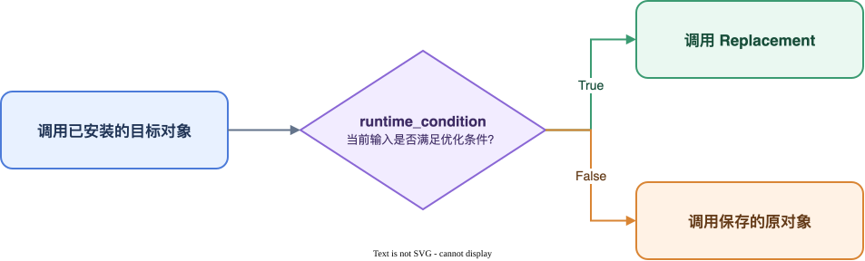

# 优化声明与 Group 设计

本文说明优化开发人员如何使用 `group`、`replace`、`wrap` 和导入兼容接口声明优化能力，以及 Group 的依赖、检查、执行和冲突规则。

普通优化声明从 `turbo_physai` 导入：

```python
from turbo_physai import group, replace, replace_import, wrap
```

导入兼容声明从 `turbo_physai.compatibility` 导入：

```python
from turbo_physai.compatibility import (
    import_alias,
    optional_import,
    registry_override,
)
```

开发人员只需声明目标对象、优化实现和 Group 边界。`ReplacementSpec`、Registry 和执行 Handler 由 Engine 管理。

## 1. Group

Group 是一项可独立选择、检查、应用和回滚的完整优化。缺少任一成员会使优化不完整或不正确时，这些成员应属于同一 Group。

```python
from turbo_physai import group, replace


MSDA = group(
    "mmcv.msda",
    replace(
        target="mmcv._ext.ms_deform_attn_forward",
        replacement=(
            "turbo_physai.optimizations.common.mmcv.msda."
            "ms_deform_attn_forward"
        ),
    ),
    replace(
        target="mmcv._ext.ms_deform_attn_backward",
        replacement=(
            "turbo_physai.optimizations.common.mmcv.msda."
            "ms_deform_attn_backward"
        ),
    ),
)
```

该 Group 同时替换 MSDA 的 Forward 和 Backward。执行前，Engine 会保存 Group 内全部目标的快照；任一成员应用失败时，已应用成员按逆序恢复。

Group ID 是 OptimizationConfig 引用优化能力的稳定标识。修改实现代码时不应随意更改 Group ID。

## 2. replace

`replace` 使用新的 Python 对象完整取代目标对象，适用于：

- 函数或方法改写；
- 类替换；
- Property 替换；
- Python 算子入口替换；
- 在 Replacement 内适配底层接口差异。

声明格式：

```python
replace(
    target="package.module.Target.forward",
    replacement="optimization.module.optimized_forward",
    aliases=(),
    runtime_condition=None,
)
```

`target` 和 `replacement` 均为可导入的 Python 对象路径。Engine 会解析实际对象，并检查对象类型和函数签名是否兼容。`replace` 不读取 Group 的 `options`。

### 2.1 函数和方法替换

MMCV MSDA 公共优化直接替换底层 PyBind 入口：

```python
MSDA = group(
    "mmcv.msda",
    replace(
        target="mmcv._ext.ms_deform_attn_forward",
        replacement=(
            "turbo_physai.optimizations.common.mmcv.msda."
            "ms_deform_attn_forward"
        ),
    ),
    replace(
        target="mmcv._ext.ms_deform_attn_backward",
        replacement=(
            "turbo_physai.optimizations.common.mmcv.msda."
            "ms_deform_attn_backward"
        ),
    ),
)
```

Replacement 应保持目标对象的外部调用契约，包括参数、返回值、Tensor Shape、`dtype`、`device` 和训练所需梯度。

### 2.2 Property 替换

目标是 Property 时，Replacement 也必须是 Property。MMD3D SparseTensor 公共优化的实现如下：

```python
def _sparity(self):
    spatial_volume = (
        self.spatial_shape[0]
        * self.spatial_shape[1]
        * self.spatial_shape[2]
    )
    return self.indices.shape[0] / spatial_volume / self.batch_size


sparity = property(_sparity)
```

Catalog 声明：

```python
SPARSE_TENSOR = group(
    "mmdet3d.sparse_tensor",
    replace(
        target="mmdet3d.ops.spconv.structure.SparseConvTensor.sparity",
        replacement=(
            "turbo_physai.optimizations.common.mmdet3d."
            "sparse_tensor.sparity"
        ),
    ),
)
```

Engine 会分别提取 Property 中实际存在的 `fget`、`fset` 和 `fdel`，用于源码证据和签名检查；开发人员不需要单独声明这些访问函数。

## 3. wrap

`wrap` 用于保留原对象并在外层增加行为，例如编译、输入转换或训练入口增强。其 Replacement 是 Wrapper Factory，接收 `(original, group_options)`，返回最终安装的新对象。

BEVFormer 编译优化的声明如下：

```python
COMPILE = group(
    "bevformer.compile",
    wrap(
        target=(
            "projects.mmdet3d_plugin.bevformer.modules.encoder."
            "BEVFormerLayer.forward"
        ),
        replacement=(
            "turbo_physai.optimizations.models.bevformer.compile."
            "compile_wrapper"
        ),
    ),
)
```

对应 Wrapper Factory：

```python
import functools
import torch


def compile_wrapper(original, options):
    del options
    compiled = torch.compile(
        original,
        mode="max-autotune-no-cudagraphs",
    )

    @functools.wraps(original)
    def wrapped(*args, **kwargs):
        return compiled(*args, **kwargs)

    return wrapped
```

`functools.wraps(original)` 保留原函数的名称、文档、签名视图和 `__wrapped__` 引用，但 `wrapped` 与原函数仍是不同的 Python 对象。

`check()` 会导入 Wrapper 所在模块并调用 Wrapper Factory 构造包装对象，但不会把包装对象安装到目标位置。因此 Wrapper Factory 不应修改无法恢复的全局状态，实际计算应在返回对象被调用时执行。

## 4. replace_import

`replace_import` 使用另一个完整模块接管原模块路径。它适用于原模块无法在目标环境中导入，但已有完整兼容模块可供替代的场景。

BEVFusion 使用 `flash_attn.modules.mha` 接管旧导入路径：

```python
replace_import(
    target="flash_attn.flash_attention",
    replacement="flash_attn.modules.mha",
)
```

两项参数均为模块路径。Engine 不导入原模块，而是在模型导入前将 Replacement 模块登记到目标模块路径。

`replace_import` 具有以下限制：

- 不支持 `aliases` 和 `runtime_condition`；
- 不支持仅替换模块中的部分属性；
- 不保存原 target 的源码 Hash，因为原模块可能无法导入；
- 应用前检查 Replacement 能否解析、是否为模块对象以及目标模块是否已提前导入。

原模块可以正常导入时，应优先使用对象级 `replace`。

## 5. 导入兼容声明

模型导入阶段可能出现符号名称差异、可选扩展缺失或 Registry 重复注册。此类问题发生在普通目标对象解析之前，应使用受限的导入兼容声明。

BEVFusion 的导入兼容 Group 同时使用四种声明：

```python
from turbo_physai import group, replace_import
from turbo_physai.compatibility import (
    import_alias,
    optional_import,
    registry_override,
)


IMPORT_COMPATIBILITY = group(
    "bevfusion.import_compatibility",
    import_alias(
        module="flash_attn.modules.mha",
        source="MHA",
        alias="FlashMHA",
    ),
    replace_import(
        target="flash_attn.flash_attention",
        replacement="flash_attn.modules.mha",
    ),
    optional_import(
        module="mmdet3d.ops.feature_decorator.feature_decorator_ext",
    ),
    registry_override(
        module="mmdet3d.ops.spconv.conv",
        registry="mmcv.cnn.CONV_LAYERS",
        names=("SparseConv3d", "SubMConv3d"),
    ),
)
```

四种接口的职责与约束如下：

- **`replace_import`**
  - 作用：使用完整兼容模块接管旧模块路径。
  - 约束：Replacement 必须是可导入模块，目标模块不能已被导入。
- **`import_alias`**
  - 作用：为模块内已有对象增加兼容名称。
  - 约束：Alias 已存在但指向其他对象时阻断。
- **`optional_import`**
  - 作用：为一个完整模块路径安装空模块占位。
  - 约束：只适用于上层不会继续访问该模块导出对象的可选扩展。
- **`registry_override`**
  - 作用：导入模块时允许指定名称覆盖 Registry 既有项。
  - 约束：Registry 必须提供可写的 `module_dict` 和 `_register_module`；未声明名称仍按原规则处理。

以上四种机制可以组成同一个导入兼容 Group，但不能与普通 `replace` 或 `wrap` 混入同一 Group。导入兼容 Group 之间的依赖也只能指向其他导入兼容 Group。

Engine 先检查并应用导入兼容 Group，再解析普通优化目标。某个导入兼容 Group 失败且成功回滚后，其他导入兼容 Group 仍可继续；只要存在未成功应用的导入兼容 Group，普通优化 Group 就会被阻断。回滚失败属于终止性错误。

`check()` 会临时应用导入兼容 Group 以完成模型模块解析，检查结束后恢复相关状态。Python 模块自身在导入时产生的任意外部副作用不在该恢复范围内。

## 6. aliases

`from module import object` 会在导入方保存独立引用。修改对象的定义位置不会自动更新这些引用，因此需要将已知引用路径声明为 `aliases`。

BEVFusion Gaussian 编译包装同时更新多个提前导入的引用：

```python
wrap(
    target="mmdet3d.core.utils.gaussian.draw_heatmap_gaussian",
    aliases=(
        "mmdet3d.core.utils.draw_heatmap_gaussian",
        "mmdet3d.core.draw_heatmap_gaussian",
        "mmdet3d.models.heads.bbox.transfusion.draw_heatmap_gaussian",
    ),
    replacement=(
        "turbo_physai.optimizations.models.bevfusion.gaussian."
        "compiled_draw_heatmap_gaussian_wrapper"
    ),
)
```

应用前，Engine 会确认主目标和所有 Alias 指向同一个原对象，并将其共同快照、替换和恢复。只有显式声明的 Alias 会被处理；Engine 不遍历所有已导入模块推测引用关系。

## 7. runtime_condition

`runtime_condition` 为可导入的条件函数路径，用于一个优化只支持部分运行时输入的场景。条件函数接收与目标对象相同的调用参数，并返回 Python `bool`。

以下为接口示例：

```python
import torch


def supports_channels_last(input, offset, mask, weight, *args, **kwargs):
    del args, kwargs
    return bool(
        input.is_contiguous(memory_format=torch.channels_last)
        and offset.is_contiguous(memory_format=torch.channels_last)
        and mask.is_contiguous(memory_format=torch.channels_last)
        and weight.is_contiguous(memory_format=torch.channels_last)
    )
```

```python
MDC = group(
    "mmcv.mdc",
    replace(
        target="mmcv.ops.modulated_deform_conv.modulated_deform_conv2d",
        replacement="optimization.mdc.optimized_mdc",
        runtime_condition="optimization.mdc.supports_channels_last",
    ),
)
```

应用后，每次调用目标对象时执行以下分发：



条件函数在 `check()` 和 `apply()` 的准备阶段只进行解析和签名检查，不会执行。条件函数或 Replacement 在训练期间抛出的异常会直接向上传播，不会触发原实现。

使用约束：

- 支持函数、方法和 `wrap` 生成的 Callable；
- 不支持类、Property 和 `replace_import`；
- 必须返回 Python `bool`，其他返回类型会引发 `TypeError`；
- 应保持轻量、确定且无副作用；
- 需要分别验证条件为 `True` 和 `False` 时的数值、梯度和性能；
- OptimizationReport 只记录条件分发对象已安装，不统计两条分支的调用次数。

## 8. Group 依赖与兼容条件

### 8.1 depends_on

当一个 Group 缺少另一个 Group 就无法正确工作时，通过 `depends_on` 声明依赖。

BEVFusion Gaussian 编译优化依赖公共 Gaussian 实现：

```python
GAUSSIAN = group(
    "bevfusion.gaussian",
    wrap(
        target="mmdet3d.core.utils.gaussian.draw_heatmap_gaussian",
        replacement=(
            "turbo_physai.optimizations.models.bevfusion.gaussian."
            "compiled_draw_heatmap_gaussian_wrapper"
        ),
    ),
    depends_on=("mmdet3d.gaussian",),
)
```

依赖关系在 Catalog 中声明。生成 OptimizationConfig 时，Generator 自动补齐依赖闭包并进行稳定拓扑排序；没有依赖关系的 Group 保持配置中的声明顺序。依赖 Group 未成功应用时，当前 Group 的执行状态为 `not_started`。

### 8.2 compatibility_check

`compatibility_check` 用于表达基础目标检查无法覆盖的 Group 级约束。条件函数接收 `CompatibilityContext` 并返回 `CompatibilityResult`。

```python
from turbo_physai import CompatibilityResult


def check_mmcv_version(context):
    actual = context.package_version("mmcv")
    supported = {"1.7.1"}
    return CompatibilityResult(
        compatible=actual in supported,
        expected={"mmcv": sorted(supported)},
        actual={"mmcv": actual},
        reason="validated MMCV versions",
    )
```

```python
MDC = group(
    "mmcv.mdc",
    replace(
        target="mmcv.ops.modulated_deform_conv.modulated_deform_conv2d",
        replacement="optimization.mdc.optimized_mdc",
    ),
    compatibility_check="optimization.mdc.check_mmcv_version",
)
```

基础检查以目标类型、签名和 OptimizationConfig 中的源码证据为主。仅当 Replacement 确实依赖目标包的其他行为、ABI 或完整模型基线时，才增加 `compatibility_check`。

兼容条件应为只读判断，不导入训练入口或修改全局状态。返回不兼容或执行异常时，Group 在对象替换前被阻断；`force_groups` 不能绕过兼容条件。

`compatibility_check` 与 `runtime_condition` 的差异如下：

| 声明 | 执行时机 | 判断内容 | 结果 |
| --- | --- | --- | --- |
| `compatibility_check` | Group 应用前一次 | 依赖版本、模型基线或实现约束 | 决定 Group 是否允许安装 |
| `runtime_condition` | 目标对象每次调用时 | 本次调用参数和 Tensor 状态 | 选择 Replacement 或原对象 |

### 8.3 options

OptimizationConfig 可以为 Group 提供 `options`。`wrap` 的 Wrapper Factory 会收到该字典，`compatibility_check` 可通过 Context 读取配置。普通 `replace` 不读取 `options`。

只有 Replacement 明确定义可配置行为时才应增加 `options`，并在对应模型或优化文档中说明字段、类型和默认值。

## 9. 检查、执行与回滚

Engine 在安装优化前完成目标解析、类型、签名、源码证据、Alias 身份、依赖和组合冲突检查。检查通过只表示该 Group 可以进入执行阶段，不等同于完成数值或性能验证。

执行规则如下：

1. 在 Group 第一次修改前保存全部成员及 Alias 的快照；
2. 按声明顺序应用 Group 成员；
3. 任一成员失败时，按逆序恢复整个 Group；
4. 回滚成功后，其他无依赖关系的 Group 可以继续执行；
5. 依赖失败 Group 的后续 Group 不执行；
6. 回滚失败时停止后续执行并报告终止性错误。

Group 的功能边界由开发人员声明。Engine 可以检查明确的目标重叠和 `depends_on`，不能从任意函数体中推断隐藏的语义依赖。因此，Group 划分与依赖声明必须通过功能测试验证。

## 10. 冲突规则

`group()` 会在登记前检查 Group 内部目标；Generator 会展开 `extends` 和 `depends_on`，再检查最终选中的全部 Group。以下问题必须在生成 OptimizationConfig 前解决：

- 同一 Group 的不同成员命中相同 target 或 Alias；
- 不同 Group 命中相同 target 或 Alias；
- `replace_import` 的模块路径与其他目标路径发生父子重叠；
- Group 依赖缺失、被禁用或形成循环；
- 模型 Replacement 直接引用继承的公共 Replacement。

即使目标和 Replacement 完全相同，跨 Group 的重复声明仍会报告 `target.group_duplicate`，不会自动合并。开发人员应删除重复选择或重新划分 Group。

模型优化继承公共优化时，应继续调用公共优化声明的标准 target，不应直接导入公共 Replacement。Generator 的静态检查可以识别：

- 直接导入及导入别名；
- 简单变量赋值；
- 标准 `importlib.import_module()` 和 `__import__()` 字符串导入。

静态检查不判断两段实现是否语义等价，也不能识别复制、内联或自定义反射工具隐藏的调用关系。这些情况需要通过代码审阅和 CI 测试控制。
