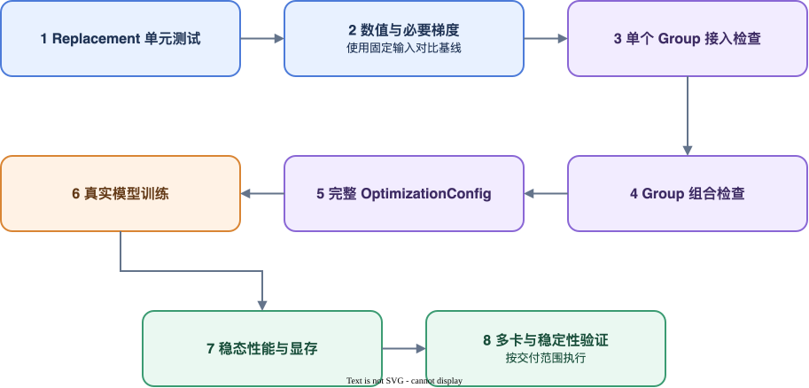

# 优化开发与接入流程

本文面向开发模型或后端算子优化的人员。优化应先在外部工程完成，再提交 TurboPhysAI 维护人员评审，不直接在框架仓库中试验业务实现。

## 角色边界

| 角色 | 负责内容 |
| --- | --- |
| 优化开发人员 | 分析性能、实现优化、划分 Group、生成 OptimizationConfig、验证数值和性能 |
| 框架维护人员 | 评审公共边界、框架能力和测试，将稳定优化纳入长期交付 |
| 训练用户 | 选择受支持模型并启动训练、查看报告；使用自定义交付时显式指定配置文件 |

## 1. 固定开发上下文

开始前记录：

- 未修改的模型基线仓库和 commit；
- 优化参考代码或明确的性能目标；
- HCU、PyTorch、依赖版本和容器；
- 单卡、多卡启动命令；
- 数据集、权重、配置和基线结果；
- 正向、反向和训练中实际需要保持的语义。

模型基线仓库应保持干净。优化实现与模型基线分离维护，确保每项代码变更、Optimization Group 和验证结果可以对应。

## 2. 创建外部工程

```bash
turbo-physai optimization init customer_model \
  --output ./customer_model_optimization
cd customer_model_optimization
python -m pip install -e .
```

生成目录：

```text
customer_model_optimization/
├── README.md
├── pyproject.toml
├── customer_model_optimization/
│   ├── __init__.py
│   ├── catalog.py
│   └── replacements.py
├── configs/
│   └── recipe.yaml
└── tests/
    └── test_catalog.py
```

Catalog 只声明 Group、目标和 Replacement。Torch、HCU、hipDNN、LightOp 和模型依赖由 Replacement 实现及交付环境提供，不在 Catalog 导入阶段初始化运行时资源。

## 3. 建立优化映射

每项修改至少记录：

| 项目 | 内容 |
| --- | --- |
| 原始入口 | 完整 Python target 路径 |
| Replacement | 完整 Python 路径 |
| 外部契约 | 参数、返回值、shape、dtype、device 和梯度 |
| aliases | 其他模块已保存的同一原对象引用 |
| 功能边界 | 缺少哪些成员会使优化不完整 |
| 运行要求 | 环境变量、原生扩展、编译缓存和启动顺序 |
| 验证证据 | 单元、模型、性能和报告结果 |

公共优化面向与具体模型上下文无关、入口稳定且能够独立验证的算子替换。模型 Forward、数据链路、张量布局、编译区域和训练过程优化归入模型专用优化。

## 4. 实现 Replacement

完整替换使用具名函数或类，并保持原目标的参数、返回值、shape、dtype、device 和梯度契约。

以下代码节选自仓库中的 MMDetection3D Gaussian 公共优化：

```python
def gaussian_2d(shape, sigma=1, device=None, dtype=None):
    import torch

    if dtype is None:
        dtype = torch.float32
    middle_y, middle_x = [(size - 1.0) / 2.0 for size in shape]
    y = torch.arange(
        -middle_y, middle_y + 1, device=device, dtype=dtype
    ).unsqueeze(1)
    x = torch.arange(
        -middle_x, middle_x + 1, device=device, dtype=dtype
    ).unsqueeze(0)
    heatmap = torch.exp(-(x.square() + y.square()) / (2 * sigma * sigma))
    return torch.where(
        heatmap < torch.finfo(heatmap.dtype).eps * heatmap.max(),
        0,
        heatmap,
    )
```

该实现保持原有调用方式和返回值形式，将坐标与 Gaussian 计算直接放在输入 Tensor 所在设备执行。对应声明见
[`turbo_physai/optimizations/common/mmdet3d/catalog.py`](../../../turbo_physai/optimizations/common/mmdet3d/catalog.py)，实现见
[`turbo_physai/optimizations/common/mmdet3d/gaussian.py`](../../../turbo_physai/optimizations/common/mmdet3d/gaussian.py)。

Replacement 调用的底层接口与原目标参数不一致时，由 Replacement 完成参数适配，但不得丢弃底层实现实际需要的参数。适配后仍需保持原目标的外部调用契约，并通过数值与梯度测试证明一致性。

不要捕获优化异常后静默调用原实现。运行错误应直接暴露具名 Replacement 的 Python Traceback。若公共优化只支持部分输入，可显式声明 `runtime_condition`；条件为 `False` 时调用原实现，条件函数或 Replacement 抛出的异常仍直接向上传播。

## 5. 声明原子优化

开发者只声明“替换谁、由谁替换、哪些成员属于一项优化”：

```python
from turbo_physai import group, replace


ENCODER = group(
    "customer.encoder",
    replace(
        target="customer_model.encoder.Encoder.forward",
        replacement=(
            "customer_model_optimization.replacements.optimized_forward"
        ),
    ),
)
```

如果缺少任一成员就会导致功能不正确或不完整，这些成员必须属于同一 Group。详细规则见 [定义优化与组织优化组](optimization_declarations.md)。

框架对每个 Group 执行统一的 target、Replacement、alias、签名和 Hash 基础检查。只有优化存在额外的依赖版本、模型 commit 或实现约束时，开发者才需要为 Group 增加 `compatibility_check`。输入 shape、Tensor layout 等随调用变化的条件使用 `runtime_condition`，不要写入启动期兼容条件。

## 6. 选择 Group 并生成最终 YAML

最小配方只维护 OptimizationConfig 身份、外部 Catalog、公共基础 OptimizationConfig 和选中的 Group：

```yaml
schema_version: turbophysai/optimization-config/v1
kind: OptimizationConfig
metadata:
  id: model.customer.development.hcu
  version: "0.1.0"
model:
  name: CustomerModel
optimization_modules:
  - customer_model_optimization.catalog
extends:
  - common.hcu.base
compatibility: {}
optimization_groups:
  - id: customer.encoder
    enabled: true
```

在干净模型仓库上生成最终 OptimizationConfig：

```bash
turbo-physai optimization generate \
  --recipe configs/recipe.yaml \
  --repo /path/to/CustomerModel \
  --commit <validated_commit> \
  --output configs/optimization.yaml
```

Generator 在写出 OptimizationConfig 前检查 Group 依赖、目标重叠和公共 Replacement 引用。检查失败时，应修改 Group 边界、配方选择或 Replacement 后重新生成配置。

## 7. 配置训练运行环境

OptimizationConfig 只描述代码优化。优化依赖环境变量、NUMA 绑定或其他训练进程启动设置时，应另外维护 RuntimeConfig：

```text
configs/
├── recipe.yaml
├── optimization.yaml
└── runtime.yaml
```

RuntimeConfig 不是所有优化工程的必需文件。不存在额外启动要求时，可以只交付 OptimizationConfig。字段与覆盖规则见 [RuntimeConfig 使用指南](../user_guide/runtime_config.md)。

使用两个配置验证原训练入口：

```bash
turbo-physai run \
  --optimization-config configs/optimization.yaml \
  --runtime-config configs/runtime.yaml \
  -- \
  python tools/train.py <原训练参数>
```

内置模型使用 `turbo-physai run --model <model>` 时，Runner 自动选择随包交付的 OptimizationConfig 和 RuntimeConfig。

## 8. 分级验证

按照以下顺序进行：



详细要求见[优化验证与交付](validation.md)。OptimizationReport 中的 `applied` 只能证明 Group 已成功安装，不能代替数值、精度和性能验收。

## 9. 提交评审

提交材料应包含：

- 外部开发工程或变更文件；
- Group、成员、target 和功能边界表；
- 公共或模型专用分类；
- 最终 OptimizationConfig、适用的 RuntimeConfig 和支持 commit；
- 实际执行的测试；
- 数值、梯度、性能和显存证据；
- 环境和启动命令；
- 最终 OptimizationReport；
- 已知限制和框架缺口。

通过评审后，模型优化迁入 `turbo_physai/optimizations/models/<model>/`；被接受的公共优化进入 `turbo_physai/optimizations/common/<framework>/`，并补充独立算子测试和文档。
