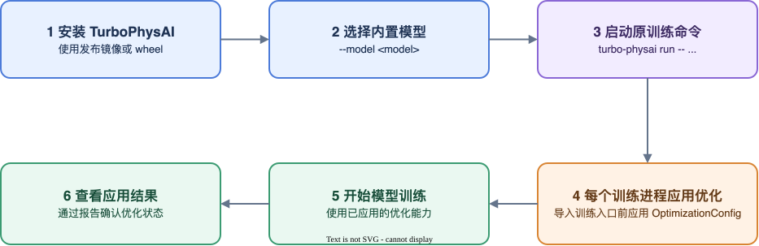

# 快速开始

本指南从已安装 TurboPhysAI 开始，说明如何对一个已能正常训练的模型启用优化。TurboPhysAI 不负责下载模型、预处理数据集或准备预训练权重。



## 1. 确认前置条件

开始前应满足：

- 模型仓库处于 TurboPhysAI 支持的 commit；
- 未使用 TurboPhysAI 时，原训练命令能够正常启动；
- 数据集已经按照模型官方说明完成预处理；
- 配置文件和预训练权重已经准备完成；
- TurboPhysAI wheel 与当前 HCU/PyTorch 环境匹配。

内置模型和接入基线见[模型支持清单](../models/support_list.md)。

## 2. 选择模型

每个内置模型均随包提供经过验证的 OptimizationConfig 和 RuntimeConfig。通过
`--model <模型名>` 选择模型后，Runner 自动加载对应配置，无需查找包内文件路径。

请从[模型支持清单](../models/support_list.md)进入对应模型说明，不要手写或修改最终 OptimizationConfig 中的 Hash 证据。

## 3. 启动训练

`turbo-physai run` 是训练用户的默认入口。该命令选择 OptimizationConfig 和
RuntimeConfig，并改写受支持的 Python、`torchrun` 或 TorchPack 启动命令。每个 Python
训练进程在导入原训练入口前应用一次 OptimizationConfig。

```bash
turbo-physai run \
  --model bevformer \
  --report-dir ./turbophysai_reports \
  -- \
  torchrun --nproc-per-node=8 tools/train.py path/to/config.py
```

Runner 自动加载 `bevformer` 随包交付的 OptimizationConfig 和 RuntimeConfig。不指定
模型时，Runner 使用内置公共 OptimizationConfig，不加载模型专用优化或 RuntimeConfig：

```bash
turbo-physai run \
  -- \
  python tools/train.py path/to/config.py
```

外部优化包或自定义交付可以显式传入 `--optimization-config` 和 `--runtime-config`。显式路径优先于
`--model` 自动选择的配置。

`--nproc-per-node` 是当前节点的训练进程数；设为 `1` 可进行单卡冒烟，设为 `8`
可启动八卡训练。NUMA 默认开启；不需要绑定时，在 `turbo-physai run` 参数中增加
`--disable-numa`。

具体模型名称和训练参数以对应模型 README 为准：

- [BEVFormer](../../../model_examples/BEVFormer/README.md)
- [BEVFusion](../../../model_examples/BEVFusion/README.md)

## 4. 查看执行结果

Rank 0 默认生成：

```text
turbophysai_reports/
├── optimization_report-<run-id>.json
└── optimization_report-<run-id>.md
```

确认：

- 预期启用的 Group 为 `applied`；
- `blocked`、`failed`、`rolled_back` 和 `not_started` 均为 0；
- `skipped` 仅对应 OptimizationConfig 中未启用的 Group；
- 训练日志中没有因 Replacement 导致的运行时异常；
- 数值、梯度和性能仍需通过真实训练验证。

优化成功安装不等于训练执行一定正确。详细解释见 [OptimizationReport](../user_guide/report.md)。

## 5. 后续阅读

- RuntimeConfig 字段和覆盖关系：[RuntimeConfig 使用指南](../user_guide/runtime_config.md)
- OptimizationConfig 字段和选择规则：[OptimizationConfig 使用指南](../user_guide/optimization_config.md)
- 完整 CLI 参数：[CLI 参考](../reference/cli.md)
- 报告字段和故障含义：[OptimizationReport](../user_guide/report.md)
